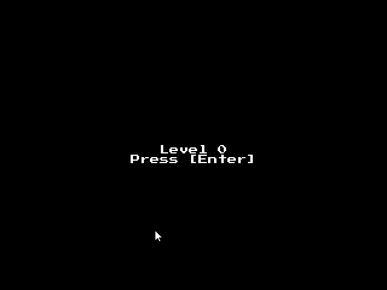

# Unity Tutorial Project in Haskell with Apecs and SDL2

This is a project based on the Unity 2D Roguelike tutorial. It doesn't follow the tutorial exactly, but is similar. Assets are from [https://learn.unity.com/project/2d-roguelike-tutorial](https://learn.unity.com/project/2d-roguelike-tutorial). It is built upon the ECS [apecs](https://hackage.haskell.org/package/apecs) for game logic and [sdl2](https://www.libsdl.org/download-2.0.php) for window management, images, audio and fonts.

## Issues during development

- Some `.aif` files wouldn't work so converted them to `ogg`
- Had issues described in [https://github.com/haskell-game/sdl2-mixer/issues/5](https://github.com/haskell-game/sdl2-mixer/issues/5) and solved it the same way, using a `Bytestring` instead of `Music`
- Some documentation about SDL2 bindings that I had a hard time finding, but managed to find what I needed from the respective Github projects of the different bindings.

## Inspiration

[https://hackage.haskell.org/package/apecs](https://hackage.haskell.org/package/apecs)

- `apecs` is an ECS I always wanted to try out

[http://jxv.io/blog/2018-02-28-A-Game-in-Haskell.html](http://jxv.io/blog/2018-02-28-A-Game-in-Haskell.html)

- Non-`apecs` example with `SDL2`

[https://nmaehlmann.itch.io/mallrl](https://nmaehlmann.itch.io/mallrl)

- Main inspiration of how to use `apecs` and `SDL2` in a game

[https://lazyfoo.net/tutorials/SDL/](https://lazyfoo.net/tutorials/SDL/)

- Tutorials on how to use SDL2

[https://github.com/haskell-game/sdl2](https://github.com/haskell-game/sdl2)
[https://hackage.haskell.org/package/sdl2-image](https://hackage.haskell.org/package/sdl2-image)
[https://hackage.haskell.org/package/sdl2-mixer](https://hackage.haskell.org/package/sdl2-mixer)
[https://hackage.haskell.org/package/sdl2-ttf](https://hackage.haskell.org/package/sdl2-ttf)

- Couldn't have done it without the SDL2 bindings

## Building on Windows

### 1. Install SDL2 via stack & pacman:

`stack exec -- pacman -Syu`

`stack exec -- pacman -S mingw-w64-x86_64-pkg-config mingw-w64-x86_64-SDL2`

### 2. Build and run

To play you have to move the built binary to the `game` folder and run it from that directory.

`stack build --copy-bins --local-bin-path game`

run `game-exe` in the game folder

### 3. Thanks

If I forgot something or you think something should be added just open an issue! Free to do whatever with my code, but the assets aren't mine.
